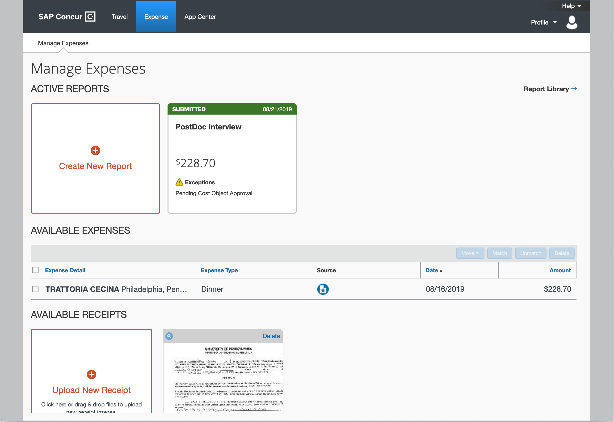
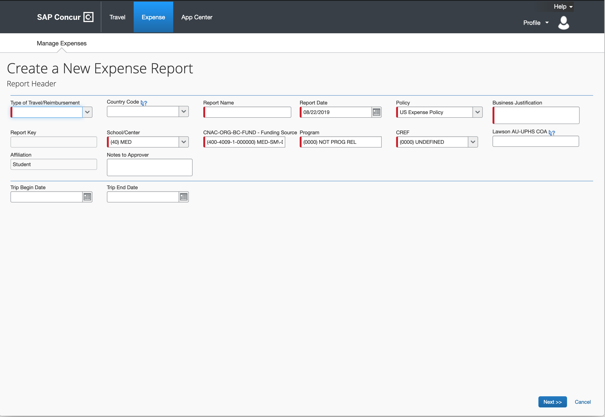
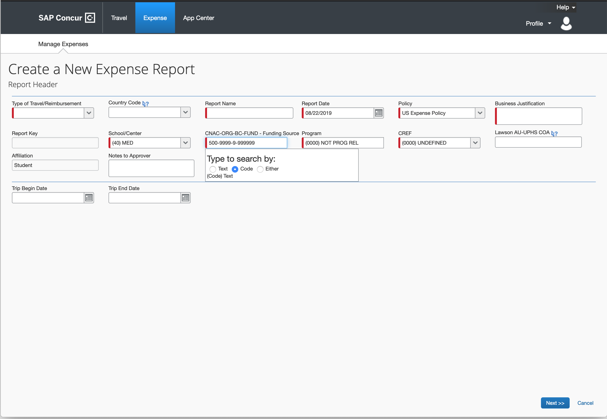
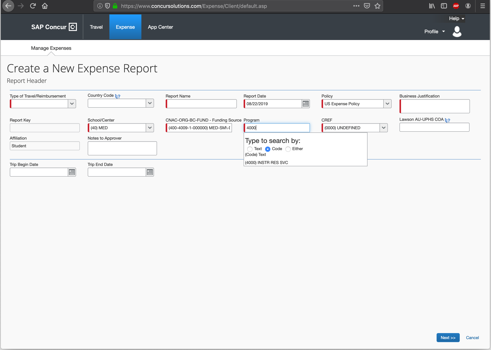
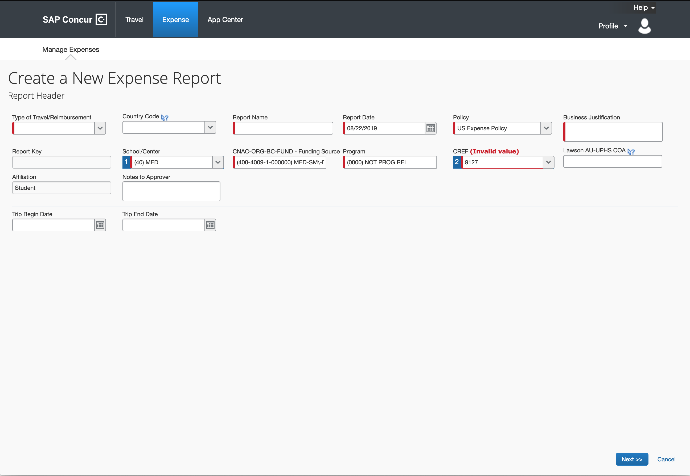
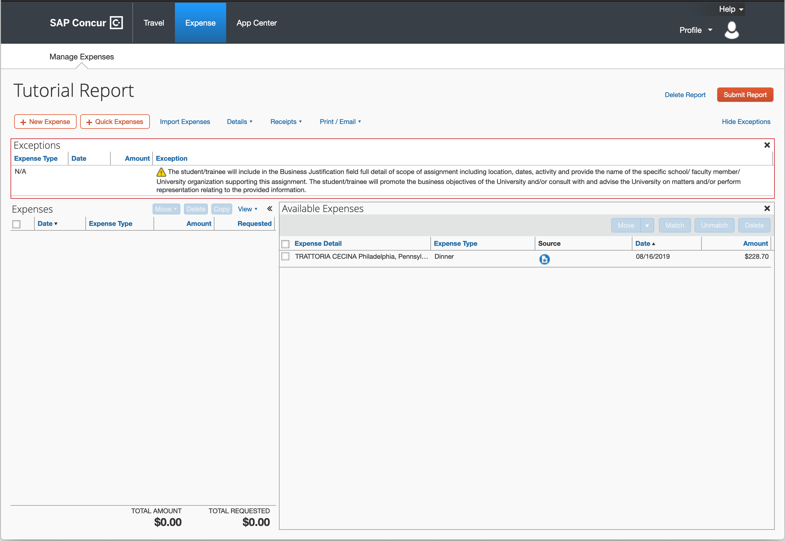
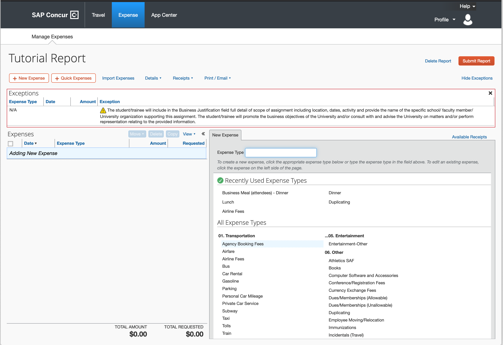
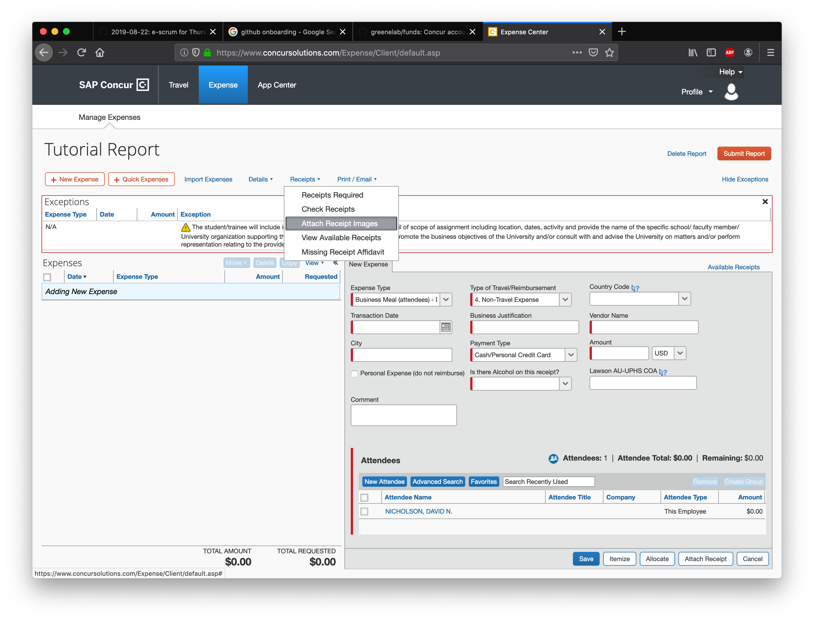

# Filling Out A Reimbursement 101

This is a tutorial on how to fill out a reimbursement. May it be for travel or for hosting a candidate interview dinner.
For this tutorial we will assume that we are reimbursing a postdoc candidate interview dinner.

## Fill Out Agreement Form

### Graduate Student

First step is to fill out an [agreement form](https://www.finance.upenn.edu/sites/default/files/Penn-Student-Agreement.pdf). 
This form is essential for getting any reimbursements accept.
**Any submitted report that misses this form will bounce back**.
Filling out this form is pretty straight forward.
For the scope of work section fill out topic keywords that describe of your thesis project (PhD Candidates) or current research (Pre-Candidacy Students).
In the Term section fill out your **projected graduation year plus one** (Just to be safe given the joys of gradudate school).
Lastly, sign your name by the Student/Trainee section and give your last 4 digits of your social security number.
Now you are done with this section and can move on towards [Opening A New Report](## Creating Reimbursement Report).

### PostDocs and Staff 

The form and link will be filled out here
 
## Filling Out Reimbursement Report

### Report Header
This section will show you how to fill out a reimbursement report.
Open [concur](http://cms.business-services.upenn.edu/penntravel/expense-report.html) and click on the expense tab.
Your screen should look like the screenshot below minus the submitted report.

Click on the create new report to get started on filling the reimbursement form out.
Your screen should look like below.

Now the fields highlighted in red are what you need to fill out. 
**Type of Travel/Reimbursement**, **Report Name** and **Report Date** are straight forward to fill out.
The policy field should be automatically filled, so don't worry about that.
Now an important field to fill out is the **Business Justification**.
In this field you need to provide justification for why you should be reimbursed.
Rule of thumb: more detail you prove the better.
For example, if this is a travel reimbursement for a conference, you *should* provide the following information:

1. Name of Conference
2. Conference Location
3. Why you attended the conference - i.e. Present work via poster or talk 
4. If PhD Candidate make sure to reference that presented work pertains to a specific aim of your thesis.
5. For other students talk about how this is your current research project.
6. For staff just provide as much detail as you can.

After you fill out the Business Justification section, select the appropriate value for the School/Center section.
For this lab select **(40) MED**.
Here comes the tricky part: selecting the correct grant number.
Please take a look at [greenelab funds](https://github.com/greenelab/funds) to find the appropriate grant number.
If not sure what number is appropriate, ask a memeber of the lab.
After you have identified the appropriate grant number, highlight and copy the **first 14 digits** (should be in the form of: XXX-XXXX-X-XXXXXX).
For example, let use this new "start up fund grant number": 500-9999-9-999999-xxxx-4000-9127. 
Paste the digits into the CNAC-ORG-BC-FUND section.
See screenshot:

The next step is to select the correct program.
Take a look at the second to last four digits of the grant number.
Copy and paste that number into the program section.
The field will auto-fill if the number is correct.
Refer to screenshot:

Lastly, you need to specify who will be the person reimbursing you. 
This is what the CREF field is designed to do.
Take the last 4 digits of the grant number and place it into this field. 
Refer to screenshot:

If the number is correct auto correct will kick in.
Click next to move onto filling out itemized expenses.

### Itemized Reimbursements

This section shows you how to fill out itemized reimbursements and assumes you have a dinner reimbursement to fill out.

Your screen should look like this:

The right hand-side shows possible expenses you can add to this report.
For your screen it might be blank and that is fine.
Next step is to click on new expense in the upper left corner.
Screen should look like this:

There are lot of options for types of expenses.
Depending on your type of reimbursement it is important to select to correct expense type.
PostDoc candidate reimbursements are considered business dinners.
Scroll down to entertainment and select **Business Meal (attendees) - Dinner**.
 
Your screen will now look like this:

The fields here are straight forward to fill out.
Add dinner attendee's names to this type of expense.
Button can be found bottom right (New Attendee).
Note: **Grants do not reimburse alcohol**.
If you have alcohol on the receipt, please indicate that on this page.
After you complete this form, make sure you attached the receipt image using the attach receipt button on the bottom right.
Make sure you have an **itemized** receipt and a receipt that shows proof of purchase.
Your report will **bounce back** if you don't provide both.
Once that is all done, hit the save button and you will return to this screen:

Congratulations!! You just fill out your expense report for dinner.
Repeat the above process if you have more expenses that need to be reimbursed.
Now last step is to attach that [agreement form](## Fill Out Agreement Form) to this report.
Look at this screenshot:

After clicking the option, navigate to the scanned  agreement form and attached it.
**Do not add it as an expense**.
If you do, the report has a high likelihood of being bounced back.
Once you have attached the form, hit the submit button (top right) and play the waiting game.
Usually it can take a few days to a few weeks.
All depends on how quickly the report gets approved.
